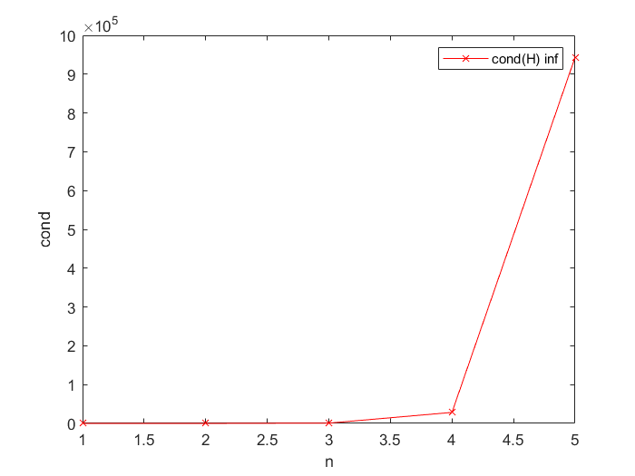

# 第二章上机作业实习报告


<div align=center>
吴家行
<br>
2020213991
</div>


作业所有程序存放在`code/`目录中

[toc]

## 1 P64第2题

### 1.1 理论分析

这道题主要考察了列主元高斯消去法的步骤，以及条件数的含义。

列主元消去法相对于naive的高斯消去法来说，在每一步中将最大的主元选出，添加了换行的操作，尽可能减小“小数”做除数的概率，得到更精确的近似解。

条件数是相对误差的表现形式，如果在线性方程组中，系数矩阵的条件数是个大数时，右端项和系数矩阵的微小变化会让解向量产生较大的误差。

列主元消元法的过程是这样的：
（1） 将系数矩阵和右端项合并为增广矩阵
（2） 每一步中选取绝对值最大的主元，如果主元不在最前面，则进行换行操作，将主元换到最前面，再进行消去
（3） 最后得到一个上三角矩阵，进行回代求解，获得解向量

### 1.2 计算程序

该题主程序存放在`main_p64_2.m`脚本文件中，`ColumnGussianElimination.m`是列主元高斯消去法的函数文件。

### 1.3 计算结果分析

第(1)问中，
```matlab
A=
    3.0100    6.0300    1.9900
    1.2700    4.1600   -1.2300
    0.9870   -4.8100    9.3400

b=
     1
     1
     1

detA=
   -0.0305

x=
   1.0e+03 *

    1.5926
   -0.6319
   -0.4936
```

第(2)问中，
```matlab
A=
    3.0000    6.0300    1.9900
    1.2700    4.1600   -1.2300
    0.9900   -4.8100    9.3400

b=
     1
     1
     1

detA=
   -0.4070

x=
  119.5273
  -47.1426
  -36.8403
```

可以看出，(1)和(2)的系数矩阵中仅有两个元素有微小的差别(3.01->3.00和0.987->0.990)，然而，对应的解向量$x$相差大，再看(1)中$A$的条件数，
```matlab
cond 1 A=
   5.5228e+04

cond 2 A=
   3.0697e+04

cond inf  A=
   5.6751e+04
```

显然，$A$的条件数都是个大数，条件数一定程度上体现了解向量对于误差的敏感性，尽管$A$的变化很微小，但仍然会引起解向量$x$的较大误差。

## 2 P65第5题

### 1.1 理论分析

这道题也是主要对条件数和误差的关系进行分析。

### 1.2 计算程序

该题主程序存放在`main_p65_5.m`文件中`hilbert.m`是获取Hilbert矩阵的函数文件。

### 1.3 计算结果分析

针对第(1)问，程序输出了n=[1,10]的所有Hilbert矩阵的无穷条件数，如下所示，

```matlab
n=1
cond inf=1
n=2
cond inf=27
n=3
cond inf=748
n=4
cond inf=28375
n=5
cond inf=943656
n=6
cond inf=29070279.0012
n=7
cond inf=985194886.8846
n=8
cond inf=33872788559.0714
n=9
cond inf=1099649476469.952
n=10
cond inf=35352333500163.55
```
可以看出，条件数随着n的增加而增加，n的数值大时，Hilbert矩阵是严重病态的，下面的曲线图更显而易见。
<div align=center></div>


之后针对第(2)问，程序对n=[1,20]的所有Hilbert矩阵用列主元高斯消去法进行求解，得到一系列的剩余向量和误差向量。

根据误差向量的输出可以观察到，随着n的增加，也就是随着条件数的升高，$\tilde{x}$的有效位数越来越少。

从程序的输出可以发现n=13开始，误差向量的分量绝对值出现大于0.5的情况，也就是$\tilde{x}$的分量出现了有效数字为0的情况，绝对误差首次达到100%，如下所示,

```matlab
n=13

r =

   1.0e-15 *

    0.8882
    0.4441
   -0.2220
    0.2220
    0.2220
    0.2220
         0
         0
   -0.1110
    0.2220
    0.1110
    0.1110
    0.1110


delta_x =

    0.0000
   -0.0000
    0.0004
   -0.0069
    0.0612
   -0.3307
    1.1491
   -2.6542
    4.1185
   -4.2430
    2.7830
   -1.0518
    0.1743
```