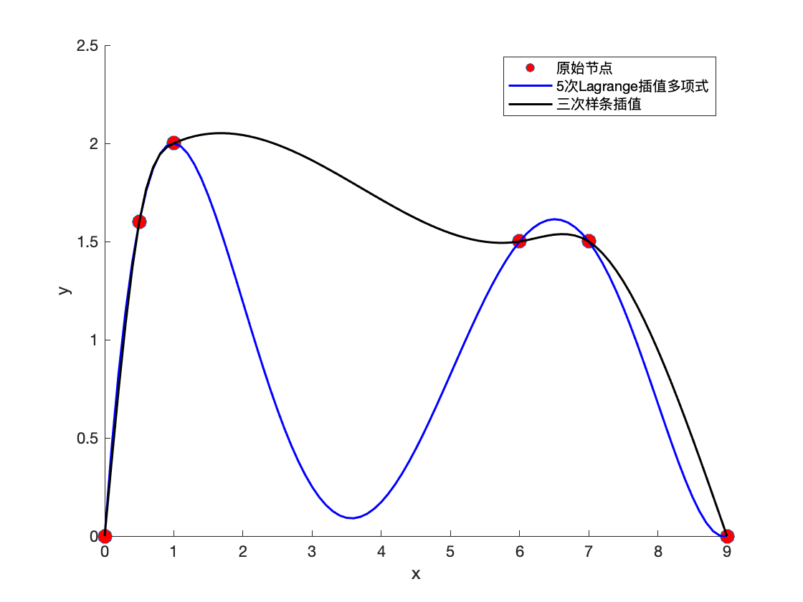
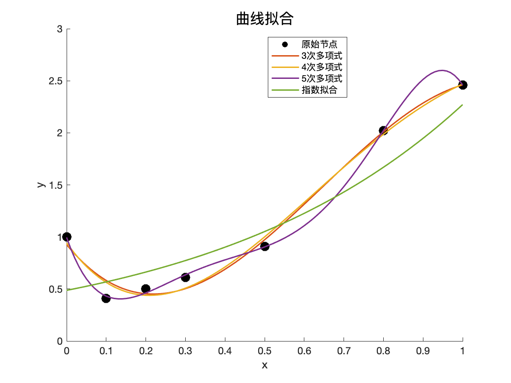

# 第6&7章上机作业

吴家行 2020213991

## P190 第二题

### 1 理论分析与算法

该题主要考察了Lagrange插值多项式以及三次样条插值的相关知识。

- Lagrange插值多项式

n次Lagrange插值多项式表达如下：

$L_n(x)=\sum f(x_i)l_i(x), i=0，1,...,n$

其中，$f(x_i)$是插值节点对应的函数值，$l_i(x)\in \Phi_n$为插值基函数.

- 三次样条插值

本题的三次样条插值要求的是自然边界条件，因此，$S''(x_0)=S''(x_n)=0$。

即$M_0 = M_n=0$

首先计算$h$
$$
h_j=x_{j+1}-x_j
$$
然后计算$\lambda$,$\mu$,$d$
$$
\mu_j=\frac{h_{j-1}}{h_{j-1}+h_j} \\
\lambda_j = 1-\mu_j \\
d_j = 6f[x_{j-1},x_j,x_{j+1}]
$$
最后利用三对角矩阵构造方程
$$
\left[ 
\begin{matrix}
2 & \lambda_1 & \\ 
\mu_2 & 2 & \lambda_2 \\
&\mu_3 & 2 & \lambda_3 \\
&...&... \\
&&& \mu_{n-2} & 2 & \lambda_{n-2} \\
&&&&\mu_{n-1} & 2
\end{matrix}
\right] 
\left[ 
\begin{matrix}
M_1 \\
M_2 \\
M_3 \\
... \\
M_{n-2} \\
M_{n-1}

\end{matrix}
\right] 
=
\left[ 
\begin{matrix}
d_1-\mu_1M_0 \\
d_2 \\
d_3 \\
... \\
d_{n-2} \\
d_{n-1}-\lambda_{n-1}M_{n}

\end{matrix}
\right]
$$

解出$M_1,M_2,...,M_{n-1}$,带入$S(x)$的表达式
$$
S(x) = M_j\frac{(x_{j+1}-x)^3}{6h_j}+M_{j+1}\frac{(x-x_j)^3}{6h_j} \\
+(f_j-\frac{M_jh_j^2}{6})\frac{x_{j+1}-x}{h_j}+(f_{j+1}-\frac{M_{j+1}h_j^2}{6})\frac{x-x_{j}}{h_j}, x\in[x_j,x_{j+1}]
$$

### 2 程序代码

该题的代码在`code/main_1.m`中，其中`third_order_mean_difference.m`是计算三阶均差的函数文件。

### 3 运行结果分析

画出的图像如下：

可见，三次样条插值拟合的曲线更平缓，更符合拟合效果；而5次Lagrange插值多项式由于次数较高，n充分大时，$R_n(x)$不一定充分小，从[3,4]和[6,7]的区间曲线可以看出，5次Lagrange插值多项式出现了Runge现象。

## P224 第二题

### 1 理论分析与算法

该题主要考察了最小二乘法曲线拟合的相关知识。

对于多项式拟合，

若取$\Phi=span\{1,x,x^2,...,x^n\}$,令
$$
(x^k, x^l)=\sum{\rho(x_j)x_j^kx_j^l} \\
(x^l,f)=\sum{\rho(x_j)x_j^lf(x_j)}
$$
法方程可以写为
$$
\left[ 
\begin{matrix}
(1,1) & (1,x) & ... &(1,x^n) \\ 
(x,1) & (x,x) & ... & (x,x^n) \\
... & ... &  & ... \\
(x^n,1)&(x^n,x)&...&(x^n,x^n) 
\end{matrix}
\right] 
\left[ 
\begin{matrix}
a_0 \\
a_1 \\
... \\
a_{n}

\end{matrix}
\right] 
=
\left[ 
\begin{matrix}
(1,f) \\
(x,f) \\
... \\
(x^n,f)
\end{matrix}
\right]
$$
拟合的曲线为
$$
s^*(x)=\sum{a_i^*\phi_i(x)}
$$
对于指数拟合，
$$
s(x)=be^{ax}
$$
为了方便计算，我们将其线性化，左右两边取对数
$$
ln{s(x)}=lnb+ax
$$
相当于拟合n=1的多项式，最后进行转化即可。

### 2 程序代码

该题的代码在`code/main_2.m`中，其中`inner_product.m`是计算内积的函数文件。

### 3 运行结果分析

分别用最小二乘法进行指数拟合、3次多项式拟合、4次多项式拟合、5次多项式拟合，画出的图像如下：

可见指数拟合效果最差，这是因为指数拟合的是个递增曲线，和原始数据点的走势不太相近，而3次多项式和4次多项式都比较接近原始数据点，5次多项式拟合效果最好。

